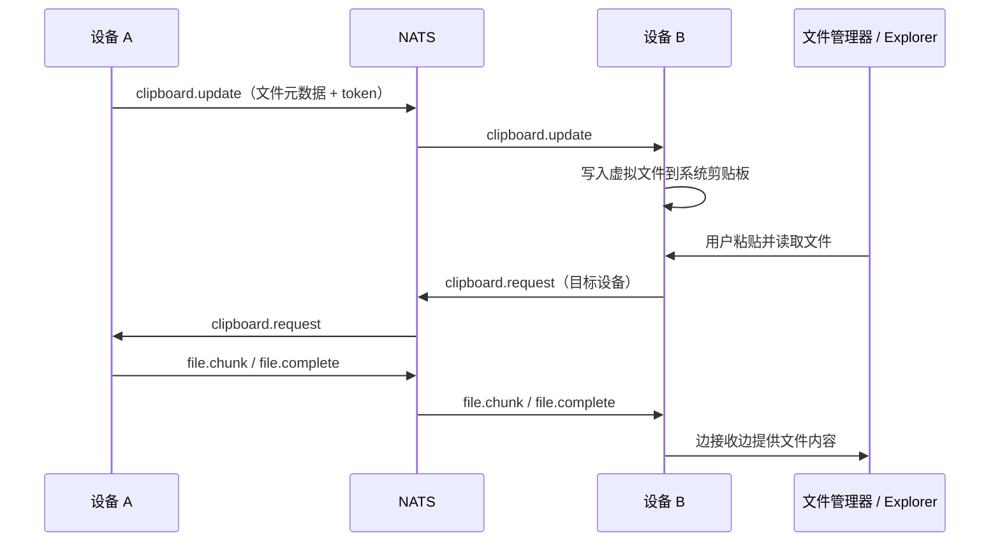

# clipboard-sync

> 面向局域网的低延迟跨平台剪贴板同步：Linux 和 Windows 间复制文本、图片与文件，文件元数据即时到达，内容在粘贴时高速按需传输。

`clipboard-sync` 是一个以本机剪贴板体验为中心的跨平台同步 Agent。两台设备加入同一个 `group_id` 后，复制文本、图片或文件，便可在另一台设备直接粘贴。在稳定的局域网中，元数据同步近乎无感；文件内容不会在复制时预先传完，也不会被广播给所有设备。

| Linux | Windows |
| --- | --- |
| X11 / Wayland 剪贴板 + FUSE 虚拟文件 | Explorer 原生虚拟文件剪贴板 |
| 文件管理器直接 `Ctrl+V` | 资源管理器直接 `Ctrl+V` |

<p align="center">
  
</p>

## 为什么使用它

- **保留原生粘贴体验**：无需先下载文件或打开专用客户端，在系统文件管理器中直接粘贴。
- **为低延迟而设计**：复制时立即发布轻量元数据，避免大文件阻塞剪贴板同步；真正的数据只在用户粘贴时发送。
- **按需传输**：复制阶段只传文件名、大小、校验和与访问 token；只有目标端读取文件时才传输数据。
- **大文件同样流畅**：内容按块流式发送，目标端边接收边写入临时文件，不会一次性载入内存。
- **局域网消息总线**：控制消息、图片数据和文件分块均经过 NATS，不依赖 HTTP、SSH 或共享目录。
- **多设备隔离**：`group_id` 限定可互相同步的设备，`device_id` 防止本机事件回环。

## 功能

- 实时同步文本剪贴板
- 同步图片剪贴板
- 同步单个文件、多个文件和文件夹的元数据
- Linux <-> Windows、Linux <-> Linux、Windows <-> Windows 文件粘贴
- 文件内容按目标设备单播，支持重复分块忽略、缺块检测与 SHA256 校验
- NATS 断连后自动持续重连
- Linux FUSE 挂载异常后自动尝试恢复
- 默认仅输出错误日志，正常运行保持安静

## 快速开始

准备两台可访问同一 NATS 服务的设备。下面以 Linux 为例；Windows 的构建与运行命令见[平台安装](#平台安装)。

```bash
git clone https://github.com/chendx-github/clipboard-sync.git
cd clipboard-sync

# Linux: X11 选择 xclip，Wayland 选择 wl-clipboard
sudo apt-get update && sudo apt-get install -y xclip fuse3 nats-server

go build -o agent ./cmd/agent
nats-server -p 4222
```

复制一份配置给每台设备，确保它们使用不同的 `device_id`、相同的 `group_id` 和可访问的 `nats_url`：

```yaml
# configs/linux.yaml
device_id: "linux-a"
group_id: "team-a"
nats_url: "nats://192.168.1.100:4222"
chunk_size: 8388608
token_ttl: 60
poll_interval_ms: 500
log_level: "error"
```

启动 Agent：

```bash
./agent run -config configs/linux.yaml
```

在另一台设备完成同样配置并启动 Agent 后，复制一段文本或一个文件，再在目标设备直接粘贴即可。

## 使用方式

### 文本和图片

1. 在设备 A 复制文本或图片。
2. 设备 B 自动接收并写入本机剪贴板。
3. 在任何支持的应用中粘贴。

### 文件和文件夹

1. 在设备 A 的文件管理器中复制文件、多个文件或文件夹。
2. 设备 B 接收元数据，并把可读取的虚拟文件写入本机剪贴板。
3. 在设备 B 的文件管理器或 Windows Explorer 中按 `Ctrl+V`。
4. 文件管理器请求内容后，设备 A 才开始通过 NATS 流式发送数据。

文件需要在 token 有效期内粘贴，默认有效期为 60 秒。过期后重新复制即可。

## 工作原理



### 平台实现

| 平台 | 接收远程文件时的实现 |
| --- | --- |
| Linux | 将远程文件映射到 FUSE 虚拟目录，并把虚拟路径写入 X11/Wayland 剪贴板。 |
| Windows | 使用 OLE 虚拟文件剪贴板对象，供 Windows Explorer 按需读取。 |

### NATS 主题

| 主题 | 用途 |
| --- | --- |
| `clipboard.update` | 广播文本、图片或文件元数据 |
| `clipboard.request` | 目标端请求文件内容 |
| `file.chunk` / `file.complete` | 单播文件数据与完成信号 |
| `image.chunk` / `image.complete` | 单播图片数据与完成信号 |

## 平台安装

### 通用要求

- Go `1.22+`
- NATS Server `2.9+`
- 两台设备网络互通，均可访问同一 NATS 地址
- 每台设备拥有独立 `device_id`

### Linux

Agent 必须以当前桌面用户身份运行。以 root 运行可能无法访问用户剪贴板，或导致 FUSE 权限错误。

Debian / Ubuntu：

```bash
# X11
sudo apt-get update && sudo apt-get install -y xclip fuse3

# Wayland
sudo apt-get update && sudo apt-get install -y wl-clipboard fuse3
```

可选的 GTK 文件剪贴板后端适合部分旧版 GNOME / Nautilus 环境：

```bash
# Debian / Ubuntu
sudo apt-get install -y python3-gi gir1.2-gtk-3.0

# Rocky / RHEL / CentOS
sudo dnf install -y python3-gobject gtk3
```

### Windows

- Windows 10 或 Windows 11
- 在 Windows Explorer 中完成文件粘贴
- PowerShell 或 CMD 可运行 Agent

构建：

```powershell
go build -o agent.exe .\cmd\agent
```

运行：

```powershell
.\agent.exe run -config configs\config-windows.yaml
```

从 Linux 构建 Windows 二进制：

```bash
GOOS=windows GOARCH=amd64 go build -o agent.exe ./cmd/agent
```

## 配置

示例文件：[configs/config.yaml](configs/config.yaml) 和 [configs/config-windows.yaml](configs/config-windows.yaml)。不要将示例中的 `device_id` 和网络地址直接用于多台设备。

```yaml
device_id: "linux-a"                         # 每台设备唯一
group_id: "team-a"                           # 相同分组互相同步
nats_url: "nats://192.168.1.100:4222"        # 共享 NATS 服务
chunk_size: 8388608                           # 8 MiB；需不大于 NATS max_payload
token_ttl: 60                                 # 文件复制元数据有效期（秒）
poll_interval_ms: 500                         # 剪贴板轮询间隔（毫秒）
cache_dir: ""                                # 留空使用系统临时目录
download_dir: ""                             # spool 和落地目录，留空使用系统临时目录
mount_dir: ""                                # Linux FUSE 挂载目录，留空使用系统临时目录
log_level: "error"                           # debug | info | warn | error
clipboard_file_writer: "native"              # Linux: native | gtk | auto
```

配置要点：

- `nats_url` 必须是所有设备可访问的地址；远程 NATS 不应填写 `localhost`。
- `chunk_size` 最低为 `65536`。默认 `8388608`，NATS 服务端的 `max_payload` 必须足够大。
- `clipboard_file_writer: "auto"` 会优先使用 GTK 后端，失败时回退到原生 `xclip` / `wl-clipboard` 后端。
- `cache_dir`、`download_dir` 和 `mount_dir` 在生产环境建议设置为稳定且可写的目录。

## 运行 NATS

本地开发可直接启动：

```bash
nats-server -p 4222
```

局域网使用时，开放 NATS 端口并将配置中的 `nats_url` 改为实际监听地址。使用 8 MiB 分块时，服务端配置至少应包含：

```conf
max_payload: 16777216
```

## 验证清单

建议按以下顺序验证部署：

1. 两端启动 Agent，确认没有 NATS 连接错误。
2. 复制一段文本，在另一端粘贴并核对内容。
3. 复制图片，在另一端粘贴并核对图像。
4. 复制一个小文件，在目标文件管理器中粘贴并核对大小与内容。
5. 复制多个文件和一个文件夹，确认目标端可正常粘贴。
6. 使用大文件验证磁盘空间、网络吞吐与内存占用。

## 常见问题

### Linux 提示找不到剪贴板命令

- X11 安装 `xclip`。
- Wayland 安装 `wl-clipboard`，并确认 `wl-copy` / `wl-paste` 在 `PATH` 中。

### Linux 无法粘贴远程文件

- 确认安装 `fuse3`，且 `mount_dir` 的父目录可写。
- 确认在文件管理器中粘贴，而不是终端或普通文本输入框。
- 旧版 GNOME / Nautilus 可尝试 `clipboard_file_writer: "gtk"`，并安装 GTK Python 绑定。
- 确认 Agent 由当前桌面用户运行。

### 两台设备没有同步

- 检查两端 `device_id` 不同、`group_id` 相同。
- 检查 `nats_url` 相同且可从双方访问。
- 检查 NATS 端口和防火墙规则。
- 将 `log_level` 临时设置为 `info` 或 `debug`，查看连接与剪贴板事件。

### 文件复制慢或失败

- 确认 NATS 的 `max_payload` 大于 `chunk_size` 加上协议开销。
- 使用低延迟网络部署 NATS，避免源文件位于高延迟网络盘。
- 检查目标设备磁盘空间；接收端会先写入本地 spool 文件。
- 复制后等待过久会使 token 过期，重新复制文件即可。

## 运维建议

- 使用 systemd 或 Windows 计划任务在用户登录后启动 Agent。
- 为每个设备配置固定的 `device_id`，并为不同团队或环境分配不同 `group_id`。
- 生产环境将 NATS 部署在可信网络中，并按实际需要配置网络访问控制。
- 默认日志级别为 `error`；排障结束后恢复该级别，避免正常传输刷屏。

Linux systemd 的服务命令示例：

```bash
/path/to/agent run -config /path/to/config.yaml
```

Windows 计划任务的启动命令示例：

```powershell
C:\path\to\agent.exe run -config C:\path\to\config.yaml
```

## 开发

```bash
# 格式化

# 整理依赖

# 构建 Linux Agent

# 交叉构建 Windows Agent
GOOS=windows GOARCH=amd64 go build -o agent.exe ./cmd/agent
```

## 当前限制

- Linux -> Windows 的大文件吞吐可能低于 Windows -> Linux，主要受 Windows Explorer 的 OLE 虚拟文件读取方式影响。
- Linux 文件粘贴依赖桌面环境对标准文件路径剪贴板格式的支持；旧版 GNOME / Nautilus 可能需要 GTK 后端。

## 贡献

欢迎提交 Issue 和 Pull Request。修复跨平台兼容性时，请说明操作系统版本、桌面环境、NATS 版本、复现步骤与日志级别，便于定位剪贴板和文件管理器差异。
